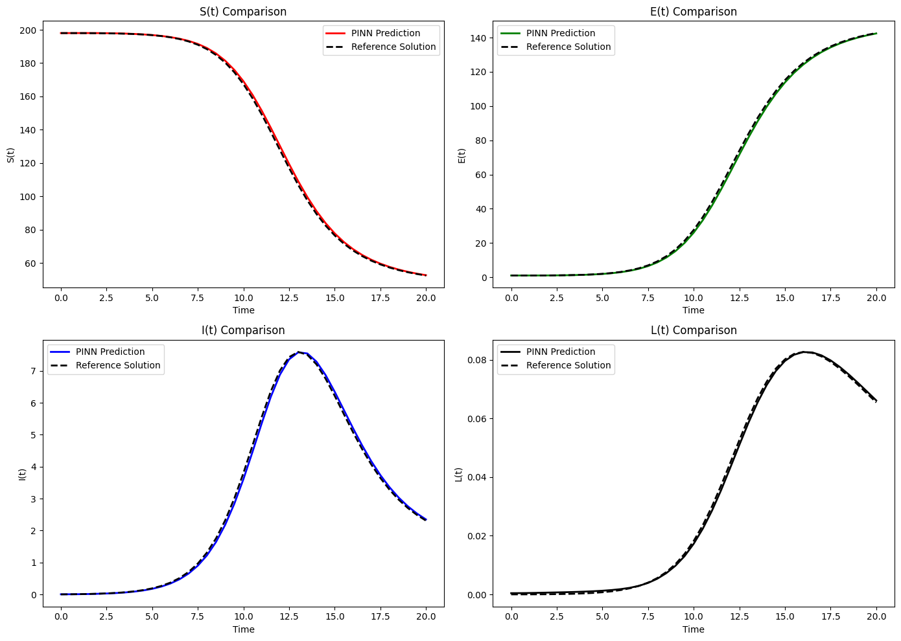
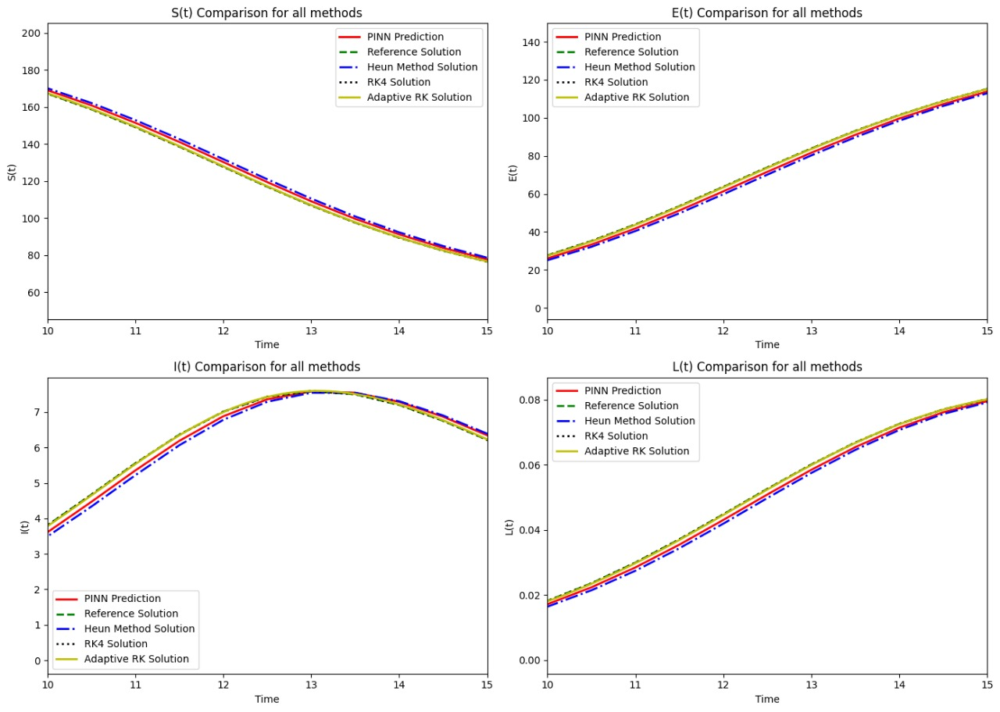

# tuberculosis-pinn-solver-numerical-solver
#  Physics-Informed Neural Network for Tuberculosis Modeling


Welcome! This project explores the use of Physics-Informed Neural Networks to solve a tuberculosis ODE model.

📄 [Download Full Report](report.pdf)

This project presents a computational solution to a tuberculosis (TB) compartmental model using:
- Classical numerical solvers
- Physics-Informed Neural Networks (PINNs)

The PINN approach integrates the system of ODEs into the neural network training process, allowing for continuous and accurate approximations of disease dynamics over time.

---

## Project Overview

We modeled the spread and progression of TB using a system of four ODEs representing the following compartments:
- **S(t)**: Susceptible individuals
- **E(t)**: Exposed (infected but not yet infectious)
- **I(t)**: Infectious individuals
- **L(t)**: Latent or partially treated individuals

Two solution methods were implemented:
1. **Numerical integration methods** (e.g., Runge-Kutta-Fehlberg, Heun’s Method)
2. **Physics-Informed Neural Network (PINN)** trained using PyTorch

---
## Methods Used

###  Numerical Solvers:
- **Heun's Method** (Predictor-Corrector)
- **Classical Runge-Kutta 4th Order (RK4)**
- **Adaptive Runge-Kutta Method**

###  Machine Learning Solver:
- **Physics-Informed Neural Networks (PINNs)**
  - Implemented using PyTorch
  - Trained on ODE physics, initial conditions, and data points
  - Supports extrapolation from t=0 to t=100

## Results

| Method       | Most Accurate      | Fastest Execution   | Extrapolation Support |
|--------------|--------------------|----------------------|------------------------|
| Heun         |  ✗                |  Fast                   | ✗                    |
| RK4          | ✓ Very Accurate   | Moderate               | ✗                    |
| Adaptive RK  | ✓ Accurate        |  Fastest               | ✗                    |
| PINN         | ✓ Accurate        | Fast (post-training)    | ✓YES                |

###  Mean Squared Error (MSE) per Method:

| Compartment | Heun     | RK4     | Adaptive RK | PINN |
|-------------|----------|---------|-------------|------|
| **S**       | 3.6878   | 0.0001  | 0.0163      | 1.37 |
| **E**       | 3.3949   | 0.0001  | 0.0151      | 1.27 |
| **I**       | 0.0227   | 0.0000  | 0.0001      | 0.009 |
| **L**       | 0.000002 | 0.0000  | 0.0000      | 0.000001 |

---
- PINN outperformed numerical integration in speed (7900% faster).



---

##  Files

📁 adaptive_quad/              → Contains `adaptive_quad.py` – Adaptive Quadrature integration method

📁 figures/                    → Plots and result visualizations (MSE curves, method comparisons, etc.)

📁 gauss-methods/              → Contains `gauss_methods.py` – Gauss quadrature-based solver

📁 heun_non_self_start/        → Contains `heun_non_self_start.py` – Heun’s method for solving ODEs

📁 romberg_integration/        → Contains `romberg_integration.py` – Romberg integration-based solver

📁 runge-kutta-method/         → Contains `runge_kutta_method.py` – Classic 4th order Runge-Kutta method

 Numerical_Project_Full.ipynb → Jupyter notebook version that includes all code and result analysis

Each Python script contains a solver implementation for one of the numerical methods used in this study, with consistent function structures and outputs and plots for modular testing and comparison


---
## Trials 

##  Attempted Method: Romberg Integration

###  What is Romberg Integration?

Romberg Integration is a numerical method used to estimate definite integrals with high precision. It combines the **Trapezoidal Rule** with **Richardson Extrapolation** to refine the accuracy of the result over successive approximations.

It starts from the basic trapezoidal estimate:

```
Tₙ = (h / 2) × [f(a) + 2 × ∑ f(xᵢ) + f(b)]
```

Then applies Richardson extrapolation recursively to eliminate lower-order error terms:

```
R(n, m) = [4ᵐ × R(n, m−1) − R(n−1, m−1)] / (4ᵐ − 1)
```

This builds a Romberg table where the bottom-right value is the most accurate approximation of the integral.

---

###  Why Romberg Integration Did Not Work in Our Case

Although Romberg is powerful for integrating functions of a single variable (usually time), it is **not suitable** for our TB ODE model because:

- Our ODE system has the form:

```
dy/dt = f(y)
```

  where **`f(y)` does not depend on time `t`** explicitly.

- Romberg Integration is most effective when integrating:

```
∫ f(t) dt
```

  with function values changing significantly over `t`.

- In our model, since the right-hand side `f(y)` is independent of `t`, the integration essentially becomes:

```
yₙ₊₁ ≈ yₙ + f(yₙ) × dt
```

  which reduces to **Euler’s method**, but with **extra computational cost** and **no added accuracy**.

---


## 👥 Team Members

- [rowida moahemd ]  
- [zyad hamed ]  
- [Ali ahmed gad ]
- [yousef samy ]
- [yousef mortada ]
- [Mohamed ward ]
- [malak sherif ]
- [yomna sabry ]
- [mohamed nasser ]
- [ Abdelrahman Emad ]
- [farah yehia ]
- [yousef magdy]
  

---

##  References

[1] Schiesser, W. E. (2014). Differential equation analysis in biomedical science and engineering. 

[2] Applied Numerical Methods with Python for Engineers and Scientists(1st ed.). (2021). McGraw-Hill Higher Education. 

[3] S. Kanwal, M. K. Siddiqui, E. Bonyah, K. Sarwar, T. S. Shaikh, andN. Ahmed, “Analysis of the epidemic biological model of tuberculosis(TB) via numerical schemes,” Complexity, vol. 2022, Art. ID 5147951,13 pp., Mar. 2022, doi: 10.1155/2022/5147951.

[4] E. D. Tadesse, M. A. Bhat, and A. Ayele, “A deterministic compartment model for analyzing tuberculosis dynamics considering vaccination and reinfection,” Heliyon, vol. 9, no. 10, p. e19674, 2023, doi:10.1016/j.heliyon.2023.e19674

[5] S. Side, A. M. Utami, S. Sukarna, and M. I. Pratama, “Numerical solution of SIR model for transmission of tuberculosis by Runge–Kutta method, Journal of Physics: Conference Series, vol. 1040, p. 012021,2018

[6] Raissi, M., Perdikaris, P., & Karniadakis, G. E. (2017). Physics Informed Deep Learning (Part I): Data-driven solutions of nonlinear partial differential equations. arXiv (Cornell University).

[7] Rasheed, A. (2024). Modeling Dynamical Systems with Physics Informed Neural Networks with Applications to PDEConstrained Optimal Control Problems.https://ntnuopen.ntnu.no/ntnuxmlui/handle/11250/3130805?show=full

[8] Pal, B., Rahaman, R., et.al. (2025). A deep learning approach to model and predict tuberculosis using PINNs. 

[9] Lu, L., Meng, X., Mao, Z., & Karniadakis, G. E. (2019). DeepXDE: A deep learning library for solving differential equations. arXiv.

[10] Walters, S. J., Turner, R. J., & Forbes, L. K. (2022). A COMPARISON OF EXPLICIT RUNGE–KUTTA METHODS. The ANZIAM Journal,64(3), 227–249.

- Cairo University Numerical Methods materials (Spring 2025)


##  Contact

rowida.mohamed04@eng-st.cu.edu.eg

